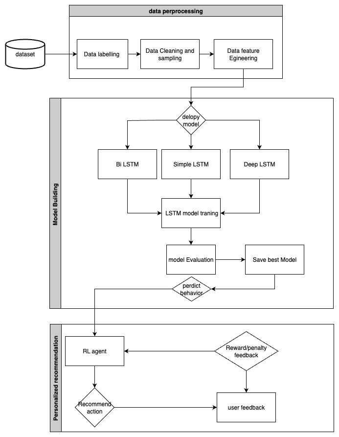
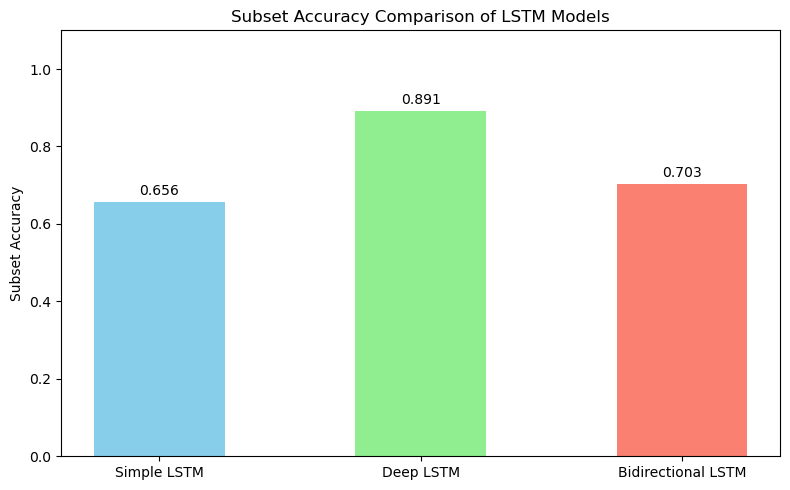

# Personalized Health Recommendation System using Deep Learning and Reinforcement Learning

## Project Overview

This project presents an intelligent **Personalized Health Recommendation System** that combines **Deep Learning** and **Reinforcement Learning** to provide adaptive health recommendations based on wearable fitness tracker data.

The system first learns unhealthy daily behaviour patterns using a **Deep Long Short-Term Memory (Deep LSTM)** network. The predicted health habits are then used as the input state for a **Q-learning Reinforcement Learning agent**, which generates personalized lifestyle recommendations. 

The objective is to demonstrate an end-to-end Artificial Intelligence pipeline, from raw wearable data preprocessing to intelligent recommendation generation.

---

# System Architecture

<p align="center">
  
</p>

<p align="center">
<b>Figure 1.</b> architecture of the Personalized Health Recommendation System.
</p>

---

# 📂 Dataset

**Dataset**

Fitbit Fitness Tracker Dataset

Source:

https://www.kaggle.com/datasets/arashnic/fitbit

The original dataset contains multiple wearable sensor files including:

- Daily Activity
- Hourly Steps
- Hourly Calories
- Heart Rate
- Sleep
- Weight

The raw files were merged and transformed into a structured health dataset for model training.

---

# Data Preparation

The preprocessing pipeline includes:

- Data cleaning
- Timestamp conversion
- Missing value handling
- Duplicate removal
- Daily and hourly aggregation
- Feature engineering
- Multi-source dataset merging
- data labelling

The final health features include:

- Daily Steps
- Sleep Duration
- Average Heart Rate
- Calories Burned

---

## Data Labeling

The original Fitbit dataset does not contain labels indicating unhealthy daily behaviours. Therefore, a rule-based labeling strategy was developed to create target variables for supervised learning.

Four health behaviour labels were generated using thresholds based on daily physical activity, sleep duration, heart rate, and calorie expenditure.

| Health Behaviour | Rule | Description |
|------------------|------|-------------|
| **Lack of Exercise** | Daily steps < **5,000** | Indicates insufficient daily physical activity. |
| **Poor Sleep** | Daily sleep duration < **360 minutes (6 hours)** | Indicates inadequate sleep duration. |
| **High Heart Rate** | Average daily heart rate > **85 bpm** | Indicates an elevated average heart rate. |
| **High Calorie Expenditure** | Daily calories burned > **3,000 kcal** | Indicates high daily energy expenditure recorded by the wearable device. |

Each label was encoded as a binary value:

- **0** = Healthy behaviour
- **1** = Unhealthy behaviour

Because multiple unhealthy behaviours can occur simultaneously, the problem was formulated as a **multi-label classification** task.

---

# Machine Learning Models

Several machine learning and deep learning models were implemented and compared.

<p align="center">
  
</p>

<p align="center">
<b>Figure 2.</b> Accuracy Comparison of LSTM models
</p>


The Deep LSTM achieved the highest classification performance and was selected as the final model.

---

# Reinforcement Learning

The trained Deep LSTM predicts four unhealthy daily habits.

These predictions become the state representation of a Q-learning agent.

State example:

```
[1,0,1,0]

↓

Lack of Exercise
Poor Sleep
High Heart Rate
High Calorie
```

Possible recommendation actions include:

- Increase walking
- Improve sleep routine
- Practice relaxation exercises
- Reduce calorie intake
- Maintain current healthy lifestyle

The Q-learning agent learns a recommendation policy through a simulated reward environment.

---

# Limitations

The reinforcement learning environment was implemented using a **simulated reward function** because the Fitbit dataset does not contain real user feedback after recommendations.

Therefore, the recommendation agent demonstrates a proof of concept adaptive recommendation system rather than validated clinical decision support.

---